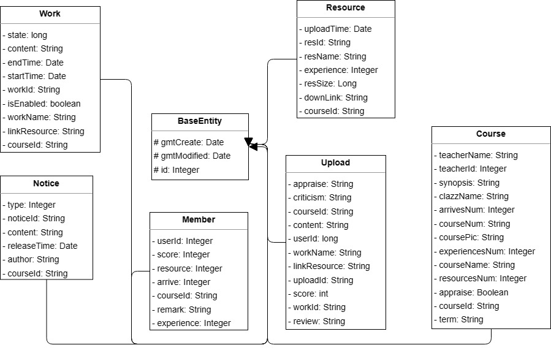
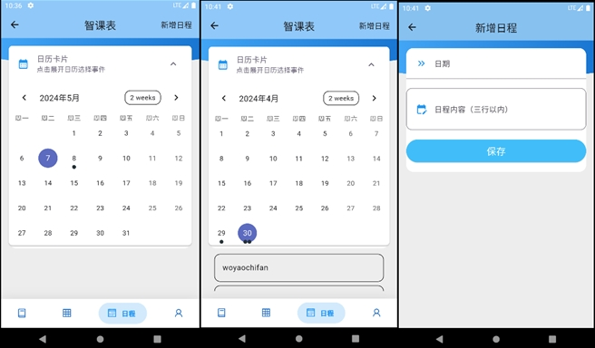
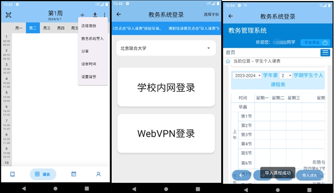

	

<h1 align="center" style="margin: 5px 0 30px; font-weight: bold;">course v1.0.0</h1>
<h3 align="center">课堂管理系统</h3>
<h4 align="center">基于 Flutter 和 Spring Boot/Spring Cloud & Alibaba C/S模式的分布式微服务架构</h4>

[//]: # ()

## 端口
**尝试了k8s部署和docker-compose编排部署：**\
需开放以下端口：
- 8080：网关
- 8848：Nacos
- 8718: sentinel
- 9100: course-monitor
- 9200: course-auth
- 9201: course-system
- 9202: course-gen
- 9203: course-job
- 9300: course-file
- 9401: app-cuser
- 9402: app-ctimetable
- 9404: app-cschedule

## 平台简介

* 课堂管理系统系统分⽤⼾、⽇程、课表、课堂四⼤模块，⽇程模块中⽤⼾可在⽇历组件中添加事件，教师和学⽣通过移动端正则
解析正⽅系统html课表⻚拿到课表数据，并上传服务端，教师开通课程，学⽣进⼊课程后，可进⾏资源管理、成员管理、
作业管理、班级通知。
* 后端采⽤若依微服务框架搭建（已集成SpringCloudAlibaba微服务相关功能、redis、mybatis、JWT鉴权、Inner
  内部鉴权、Feign调⽤等等），可便于本项⽬后台管理系统；使⽤⽂件服务技术存储远程传输⽂件；数据库为MySQL，成
  员作业提交历史记录采⽤mongoDB，⽤⼾登录与鉴权和签到码考勤功能采⽤Redis；移动端在已有Android知识
  （Activity/Fregment/Intent/Retrofit/Room/权限/封装设计等）的基础上，使⽤AndroidStudio采⽤Flutter跨端开发，⽀
  持Android/IOS，⼀切皆是widget，⾃定义组件，使⽤http/dio⽹络封装库，json_model，floor_ORM，Token封装，
  SharePrefences封装⽀撑项⽬，使⽤InAppWebView获取教务课表数据，采⽤第三⽅卡⽚、TCB⽂档服务、富⽂本编辑
  器、⽂件上传下载、⽇历等组件实现各功能。
* 注册中心、配置中心选型Nacos，权限认证使用Redis。

#### 友情链接 [课堂管理系统/course-Cloud](https://gitee.com/SeaLandShell/SmartTimetableSchedule) Fitee仓库。

## 系统模块

~~~
com.course     
├── course-ui              // 前端框架 [80]
├── course-gateway         // 网关模块 [8081]
├── course-auth            // 认证中心 [9200]
├── course-api             // 接口模块
│       └── course-api-system                          // 系统接口
├── course-common          // 通用模块
│       └── course-common-core                         // 核心模块
│       └── course-common-datascope                    // 权限范围
│       └── course-common-datasource                   // 多数据源
│       └── course-common-log                          // 日志记录
│       └── course-common-redis                        // 缓存服务
│       └── course-common-seata                        // 分布式事务
│       └── course-common-security                     // 安全模块
│       └── course-common-swagger                      // 系统接口
├── course-modules         // 业务模块
│       └── course-system                              // 系统模块 [9201]
│       └── course-gen                                 // 代码生成 [9202]
│       └── course-job                                 // 定时任务 [9203]
│       └── course-file                                // 文件服务 [9300]
├── course-modules-app         // 智课表APP业务模块
│       └── app-cuser                                  // 用户模块 [9401]
│       └── app-ctimetable                             // 课表模块 [9402]
│       └── app-cschedule                              // 课堂管理 [9404]
├── course-visual          // 图形化管理模块
│       └── course-visual-monitor                      // 监控中心 [9100]
├──pom.xml                // 公共依赖
~~~

## 服务端架构图

	

## 数据库设计

## 系统业务流程图

## 总体包图

## 类图
### 用户模块

### 课表模块

### 课堂管理模块

## 效果图

## 联系作者
QQ号：1769168668